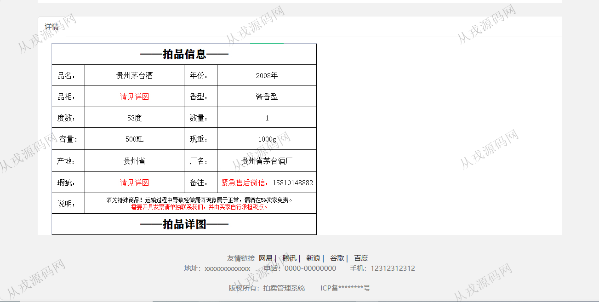
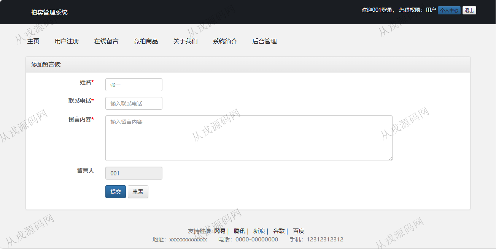

<h1 align="center">92.拍卖管理系统</h1>

 获取sql文件 QQ: 386869957 QQ群: 377586148 

 [推荐站点: 从戎源码网](https://armycodes.com/) 

## 简介

> 本代码来源于网络,仅供学习参考使用!
>
> 提供1.远程部署/2.修改代码/3.设计文档指导/4.框架代码讲解等服务
> 
> 用户端访问地址：http://localhost:8080/
> 
> 用户：001 123456
> 
> 管理后台登录地址：http://localhost:8080/login.jsp
> 
> 管理员：admin 123456
> 
>

## 项目介绍
基于jsp+servlet的拍卖管理系统：前端 jsp、jquery，后端 servlet、jdbc，角色分为管理员、用户；集成商品竞拍、分类管理、商品管理、订单管理等功能于一体的系统。

## 功能介绍

### 用户

- 基本功能：登录、注册、退出、个人资料查询、密码修改
- 网站主页：导航栏，轮播图，竞拍商品列表展示
- 在线留言：用户可以发布留言信息给网站管理员
- 竞拍商品：分类检索，按名称搜索，商品列表，商品详情查看，商品竞拍操作
- 其它：关于我们，系统简介
- 个人中心：竞拍记录查询，我的订单查询，我的留言，

### 管理员

- 账号管理：管理员账号管理，管理员账号添加，注册用户管理，添加新用户，密码修改
- 分类管理：分类信息的增删改查
- 商品管理：商品信息的增删改查，多条件搜索查询，富文本编辑
- 竞拍管理：竞拍信息的查询，编辑，删除，多条件搜索查询
- 订单管理：订单信息的详情查看，编辑，删除，关键词搜索
- 系统管理：友情链接添加，友情链接查询，轮播图添加和查询，单页简介添加和查询，留言管理

## 环境

- <b>IntelliJ IDEA 2021.3</b>

- <b>Mysql 5.7.26</b>

- <b>Tomcat 7.0.73</b>

- <b>JDK 1.8</b>

## 运行截图

